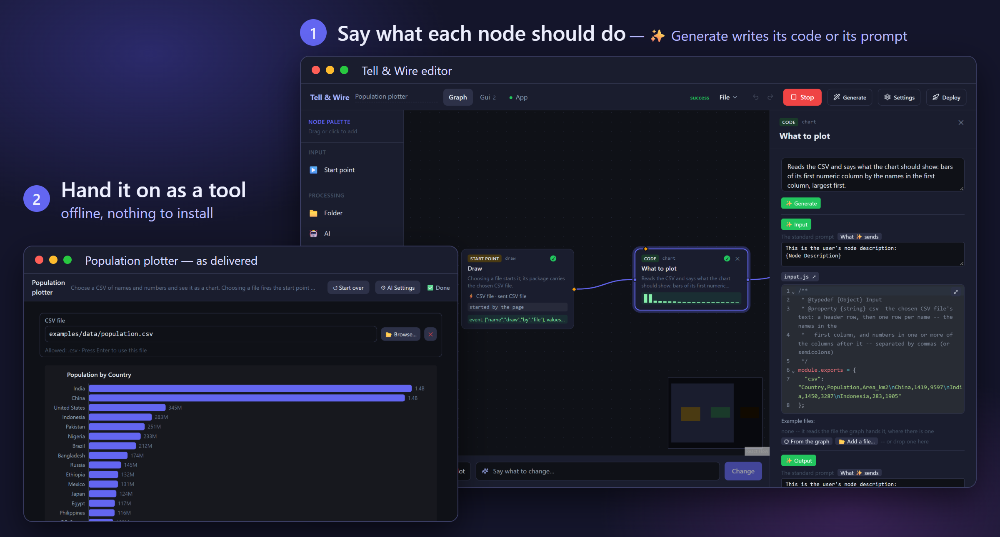

<div align="center">

# Tell-and-Wire

**Wire nodes on a canvas into an AI workflow — then hand the result to someone else<br>
as a tool that runs on their machine: offline, on a local model, with no account and no cloud bill.**

A self-hosted, no-code / low-code workflow builder for AI: visual programming for LLM
pipelines, multi-agent workflows and small local apps. Say in plain words what each node
should do, and AI writes its code or its prompt; give the graph a page — a file picker, a
chat, a chart — and 🚀 Deploy packs it into a folder someone else can run.

### ⬇ [Windows](https://github.com/Archimedes79/Tell-and-Wire/releases/latest/download/tell-and-wire-windows.zip) · [Linux](https://github.com/Archimedes79/Tell-and-Wire/releases/latest/download/tell-and-wire-linux.zip)

Unzip, start `run.cmd` (Windows) or `./run.sh` (Linux); the editor opens in your browser.<br>
Node.js is included in the zip.

[Quick start](#quick-start) · [Examples](#the-examples) · [Documentation](#documentation) · [Licence](#licence)



</div>

---

## Why

| | |
|---|---|
| 🔒 **Your data stays on the machine** | A model on your own machine is the default, not a fallback. Everything binds to `127.0.0.1`, and there is no telemetry. Contracts, records or personnel files are processed where they already are. |
| 💶 **It is free to run** | A 7B model on an ordinary workstation classifies, extracts, summarises and rewrites. Where that is not enough, pin *one* node to a paid provider instead of moving the whole pipeline into the cloud. |
| ✨ **No AI expertise required** | Describe in plain language what a node should do, and ✨ writes the rest: what goes in, what comes out, and the JavaScript or the prompt. No prompt engineering, no vector store, no framework, no glue code. |
| 🚀 **You ship a tool, not a prototype** | 🚀 Deploy packages the graph with the real execution engine. The recipient needs Node and nothing else, and the code nodes run there too. A graph with a page deploys *with its page*. |
| 🔍 **Nothing is hidden** | Every file ✨ writes is a file you can read and change — `input.js`, `output.js`, `code.js`, `prompt.md` — beside the graph in plain JSON, so `git diff` reads like text. |

> **The cheap option is the private one.** Running locally costs nothing *and* keeps the
> data where it is; the two are not a trade-off.

## What is different about it

- **Cloud is the opt-in, not the default.** In most workflow builders local execution is
  something you assemble; here it is the state you start in.
- **A deploy bundle vendors the engine, not generated code**, so a deployed graph
  behaves identically to the one in the editor — the same components, verbatim.
- **A graph can carry its own page.** Its blocks — a file picker, a text block, a chart —
  are what a person uses, and each connects itself to the graph by name: its data goes to
  a start point, using it fires one, it shows an end point. Nothing is wired to the page.

## Use Cases

- **Document batch processing** — a directory of files, a Code/AI node that extracts or
  summarises each one, an end point that writes the results back to disk, a file each.
- **Charts from your own data** — choose a CSV, see the chart: a page with a file picker
  and a chart, and one Code node that says what to plot; see [examples/population_plotter/](examples/population_plotter/).
- **Local-LLM chat or report tool** — an AI node on a local model that reads a file
  at its input, paired with a text block on the page: a runnable front-end with zero UI code.
- **A graph as a standalone tool** — once it works in the editor, 🚀 Deploy hands a
  non-technical user or a CI job something that runs without the Tell-and-Wire editor at all.

## Privacy and local processing

Nothing leaves the machine unless the graph itself sends it there.

- The editor and a deployed bundle bind to `127.0.0.1` — reachable from the machine
  itself, not from the network — unless started with `--host` for a container, which
  `docker compose` publishes on the host's `127.0.0.1` in turn.
- The file browser is tied to that bind: on anything but loopback it switches itself
  off rather than hand the machine's filesystem listing to the network
  (`engine/src/host/serve.ts`).
- No analytics or phone-home calls exist in the code; the only outbound connections are
  the ones your graph is configured to make.
- API keys are write-only, and the AI setting belongs to your machine rather than to
  the graph — a graph you hand on carries neither a key nor a model choice of yours,
  unless a node names its own.
- A deploy bundle runs offline: the engine, the project folder and the files the graph starts
  on. A graph on a local model works with no internet access at all.

---

## What's in it

- **Visual graph editor** — a node canvas with undo/redo; drop a graph `.json` file
  or a project folder on the window to open it, or use **Open**; every example in
  `examples/` is a project folder.
- **Seven node types** — Start point (where a round begins, by name: started by the page,
  by a call, or by itself — when the tool starts, on a clock), Folder (the files in a
  folder), AI, Code (JavaScript), Data (a value kept between runs: typed, or a file
  dropped on it), End point (what the graph hands back, under its name; a file or a
  folder of it if asked), and Subgraph: a node that holds a graph of its own, so a graph
  grows in depth as well as in width. The page is no node: one per graph, its blocks
  beside the nodes.
- **One ▶ Run, and results in place** — ▶ Run runs the application, as an IDE does: its
  page opens and runs the graph as it is used; a graph a call starts opens as its caller,
  a box for each part it reads and a button per start point; otherwise what starts itself
  starts, or the whole graph runs once. After a run every node shows what it made under
  its port: a line of text, *214 rows* and the first, a small chart of numbers, a
  thumbnail, or the first line of an error.
- **A gate on every node** — its ◆; a start point shows none, rounds begin there. Wired from
  a start point, a ◆ opens in the rounds that start point begins; from a code node, only
  `true` opens it, so a code node that returns booleans is the filter and the router. A
  start point's package says whether the round began there. What a node made last stands
  until it runs again.
- **The flow in one file** — `flow.json`: the tool's name and description, which nodes
  there are, and every wire as one line, `"draw.data -> chart.csv"`. Nothing about
  any one node is in it; where nodes sit on the canvas is `layout.json`.
- **A node is its text; ✨ writes the rest** — say what a node should do, and ✨ writes
  its files from that: `input.js` (what one call is handed, with an example), `output.js`
  (what it returns — its keys are the node's outputs) and the body, `code.js` or an AI
  node's `prompt.md`. Each is a file you can open, read and change; one press writes
  what is missing, and new code is tried on the example and repaired before you see it.
- **Graph DSL** — plain JSON with typed ports (`data_type`, `multi`, `required`, and
  `field`: the part of a start point's package an input takes), so a node's inputs and
  outputs are never ambiguous.
- **Execution engine** — topological order with per-node status, batch items run
  concurrently, a failed item is reported as `partial` while the rest continue, transient
  AI failures are retried, and Stop ends the work rather than just stopping watching it.
  The toolbar counts items *within* the running node and says when a model has gone quiet,
  so a long batch is never mistaken for a hang — and a model that answers with nothing at
  all fails the node instead of quietly passing an empty string on.
- **A project is a folder** — `flow.json` plus one folder per node under `nodes/`: code
  and prompts live there in `.js`/`.md` files, so a language server and `git diff` both
  work on them. The page is a folder of its own beside them, `page/`, its blocks in
  `page.json`. A single `.json` graph with everything inline opens too.
- **A page** — built like a document, on the Gui tab under the tool's name and
  description: type headings in place, press `/` to
  insert a chat, a file picker, a dropdown, a chart or a table, and deploy it together
  with the graph. Each block says where its data goes, what using it fires and what it
  shows, by the name of a start or end point. A block runs no code: a chart, a table or an
  image shows what arrives, drawn at the block's real size, and what shapes it is a node.
- **Start points** — a round begins at a named start point: one the page starts (a button
  pressed, a message sent, a file chosen), one a call starts (a script, an assistant over
  MCP, the graph above), or one that starts itself — when the tool opens, on a clock. A
  round runs what its start point is wired to, so one page can hold several tools. What
  arrives is one package, and each input takes the part of it it needs.
- **A prompt you can see** — every ✨ shows the prompt it is written with, and what it
  sends, word for word; an AI node's instructions are its `prompt.md`. It answers in
  plain text -- in JSON, each key on its own output, only where its `output.js` names
  several outputs or a value that is not text.
- **Files as they are** — a node that reads a file is handed what is in it: a Word
  document as its text, headings, lists and tables kept; a picture or a PDF as itself,
  which an AI node sends to its model, so a statement in any layout is read as it came.
- **Tools (MCP)** — an AI node can call the tools of MCP servers while it answers.
- **A real editor, and your own** — each file is shown and edited in its row
  (highlighted, full-window on ⤢), or opened in your own editor with one click; what you
  save there comes back by itself.
- **The same way everywhere** — an AI node and a code node are built alike: its text,
  then ✨ Input, ✨ Output and ✨ Code (or ✨ Prompt), each with its prompt and its file.
  Give ✨ Input real files to write from — from the graph (⟳), a file (📂), or drop one
  on the node; press ▶ Try and see what comes out for input.js's example, held to
  output.js. Then say what to change in one line — ✨ changes the body and the node's
  text together — or press ✨ Fix where it failed. There is no Save in a node's panel:
  a change is in the graph at once, and Undo takes it back.
- **An MCP server** — `--mcp` lets an AI assistant generate, validate, save and run
  graphs, confined to one folder.
- **Deployment** — a self-contained bundle, or a container.
- **Graph Runner CLI** — run any saved graph from the command line.

## How a tool lives

A tool is a project folder, and the editor is its IDE.

1. **Build it.** The Graph tab is what it does: nodes and wires (`flow.json`,
   `nodes/<id>/`), from its start points to its end points. The Gui tab is what whoever
   uses it sees: its blocks (`page/page.json`), filled in with what it starts on and
   connected to those points by name. A node's text says what it should do; ✨ writes its
   files, and ▶ Try runs one on its example.
2. **Run it.** ▶ Run runs the application, as an IDE runs what it builds: with a page the
   App tab opens with its fields as they are set, and the graph runs when the page is
   used -- a button, a file chosen. A graph a call starts opens there as its caller: a box
   for each part it reads, a button per start point. Otherwise its start points that start
   themselves start it, on their clock, and a graph with no start point runs once, whole.
   ■ Stop ends it.
3. **Hand it on.** 🚀 Deploy packs the graph, the engine that ran it and the files its page
   starts on into a zip; `run.cmd` or `run.sh` starts it on any machine with Node.
4. **Use it.** Opened there, a tool starts the way ▶ Run started it here: its page waits
   to be used -- or, for a start point a call starts, to be called, from its page's call
   boxes or a script -- and its clock keeps time in its server, whether or not the page is
   open.

## The examples

`examples/` holds the graphs, `examples/data/` the files they start on. Open one with
**Open**, or drop it onto the editor window.

The first three are the **master examples**: each is a page, a start point, one node and
an end point, two or three wires, and each can be built by hand in a few minutes. They are
also the tests the editor is held to —
[`masterExamples.test.ts`](editor/src/masterExamples.test.ts) builds each one
the way a person does (a node dropped, blocks added, a wire dragged), checks that what it
built *is* the example, and runs it.

| Graph | What it shows | Needs a model |
|---|---|---|
| [population_plotter](examples/population_plotter/) | Choose a CSV, see the chart: a file picker, a chart, and one code node that says what to plot | no |
| [folder_summaries](examples/folder_summaries/) | Choose a folder, read a summary of every file in it: one model call per file, one window | yes |
| [chat](examples/chat/) | A chatbot: a chat block and a model. Sending fires the start point "send", whose package carries the message and the conversation; the answer reaches the end point "reply", which the chat shows | yes |
| [file_summarizer](examples/file_summarizer/) | Read a file and summarize it: choosing a file, changing the length or pressing the button fires one start point, whose package carries the file and the length | yes |
| [paper_review_panel](examples/paper_review_panel/) | Several AI reviewers (scientific, adversarial, claims, references, figures) read a manuscript in parallel; a judge merges their findings into ranked advice | yes |
| [nested_statistics](examples/nested_statistics/) | A part of the work built as its own graph: the counting lives inside one node, and the graph above it reads as a sentence. A call starts it -- from a page of its own in `frontend/`, or a script | no |
| [portfolio_review](examples/portfolio_review/) | A team of AI analysts reviews a portfolio export in any format: a data reader, the hard numbers in code, nine specialists -- macro, risk, quant, valuation, optimisation, tax, diversification, psychology and a counter-thesis -- wired in the order their findings depend on each other, and a lead advisor; the page shows the allocation, the master action list and the report, saved as Markdown | yes |

**Every example is held to the same things by the test suite**, and an example added to the
folder is held to them without anyone listing it. `engine/src/examples.test.ts` checks that
it can be ordered, that it runs whole on nothing but its own defaults, and that it can be
**deployed** — written as a bundle into an empty folder and run from there, with the files
it starts on carried along. CI also runs `check` on every example, and `test --offline`,
which runs each code node on its `input.js` example and holds it to its `output.js`, and
runs again each round the example kept in its `tests/` folder -- what its start points were
sent and its models answered handed in, the rest run, the end points held to what they
handed back (`.github/workflows/ci.yml`). What each example is there to show is held in the same test
file: what using the page starts, for chat, file_summarizer, folder_summaries and
population_plotter, and for nested_statistics that the graph inside runs within the whole
and on its own.

Each is a project folder: `flow.json` for the wiring, the page, where it has one, in
`page/page.json`, and every node's settings, ports, code and prompts as files of their own
under `nodes/` — open `nodes/chart/code.js` and it is plain JavaScript. The ones that
need a model call the one you choose in **⚙ Settings → AI** (or in `ai-settings.json`,
see [docs/ai-providers.md](docs/ai-providers.md)) — a hosted model with an API key, or
one running on your own machine.

A path inside a graph resolves against the working directory, so run the examples from
the repository root:

```bash
node engine/src/main.ts examples/population_plotter
```

## Quick start

| System | Download | Start it with |
|---|---|---|
| Windows (x64) | [tell-and-wire-windows.zip](https://github.com/Archimedes79/Tell-and-Wire/releases/latest/download/tell-and-wire-windows.zip) | `run.cmd` |
| Linux (x64) | [tell-and-wire-linux.zip](https://github.com/Archimedes79/Tell-and-Wire/releases/latest/download/tell-and-wire-linux.zip) | `./run.sh` |

Each zip includes Node.js. The editor opens in your browser at <http://127.0.0.1:8000>,
or the next free port. Older versions are on the
[releases page](https://github.com/Archimedes79/Tell-and-Wire/releases).

No Docker needed: the engine is TypeScript that Node runs directly, with no
dependencies. The [container image](docs/install.md#in-a-container) is for servers.

**From the source**, on any system with Node 24 or newer:

```bash
git clone https://github.com/Archimedes79/Tell-and-Wire.git
cd Tell-and-Wire
.\start.ps1       # Windows, PowerShell (bare `start` is a PowerShell command, not this)
start.cmd          # Windows, cmd -- double-clicking it works too
./start.sh         # macOS, Linux
```

That installs on first use, builds the page, and opens the editor; it needs Node 24 or
newer. By hand it is `npm ci`, `npm run build`, `npm start`; `npm run dev` is the same
with live reload. Details in [docs/install.md](docs/install.md).

**Running a graph needs no editor at all:**

```bash
node engine/src/main.ts examples/population_plotter   # once
node engine/src/main.ts my_project --serve             # with its page
node engine/src/main.ts my_project --bundle ./out      # to hand to someone
node engine/src/main.ts check examples/population_plotter   # what is wrong, without running
node engine/src/main.ts examples/nested_statistics --event measure --value "paragraph=One two."   # one start point, sent a value
```

## Documentation

| Document | What is in it |
|---|---|
| [docs/user-guide.md](docs/user-guide.md) | A first tool in 30 minutes, by mouse: install, model, page, node, run, hand on -- and where the time goes |
| [docs/install.md](docs/install.md) | Running the editor from a download or a checkout, working on it, containers, tests and CI |
| [docs/graphs.md](docs/graphs.md) | The Graph DSL, code and AI nodes, the page and its blocks |
| [docs/ai-providers.md](docs/ai-providers.md) | Providers, the one AI setting and a node's own, where the API key goes |
| [docs/deployment.md](docs/deployment.md) | Deploy bundles, containers, the Graph Runner CLI |
| [docs/mcp-server.md](docs/mcp-server.md) | Letting an AI assistant (any MCP client) generate, check, save and run graphs |
| [docs/licenses.md](docs/licenses.md) | The licence check: Tell-and-Wire's own terms, every package it is built from, and how each copy carries them |
| [docs/wrapper.md](docs/wrapper.md) | The wrapper around the graph core: the runtime API a page uses, the design API the editor uses, and the protocol a graph core speaks -- in-process or as a program of its own |
| [docs/architecture.md](docs/architecture.md) | How the pieces fit, the decisions that hold them together and why, and what is left out for now; diagrams mapped to files in [arch/](arch/overview.md) |
| [docs/connection-points.md](docs/connection-points.md) | Where something else meets Tell-and-Wire -- the folder, the graph's names, the runtime API, a body's protocol |

## Project structure

```
Tell-and-Wire/
├── engine/src/             # Runs a graph, serves the editor, ships as a bundle. No UI framework.
│   ├── elements/           #   one folder per element: nodes/<kind>/<Kind>NodeRunner.ts, widgets/<kind>/<Kind>WidgetRunner.ts
│   ├── execution/          #   the executor and what starts a run
│   ├── authoring/          #   what ✨ writes for a node, and how its files are read
│   └── host/  ai/  cli/    #   the server and its contract, model providers, the command line
├── editor/src/             # The page in the browser, built on the engine
│   ├── elements/           #   the same folders: <Kind>NodeGuiBuilder.ts, <Kind>WidgetView.tsx, <Kind>…Panel.tsx
│   ├── authoring/          #   a node's text and a row per ✨, ▶ Try, the live transcript
│   └── app/  canvas/  page/  store/  api/  runtime/  dialogs/  document/  ui/
├── examples/               # Example projects, one folder each: flow.json + nodes/
├── docs/                   # The documents linked above
├── arch/                   # Architecture diagrams, every box mapped to its files
├── scripts/                # launchers behind start/stop, npm run dev, the download zips, the licence check
├── start.cmd  start.ps1  start.sh   (and stop.*)   # start or stop the editor from a checkout
└── Dockerfile  docker-compose.yml   # docker compose up: the editor beside a local model server
```

---

## Licence

Tell-and-Wire is **source-available, not open source**: [PolyForm Noncommercial
1.0.0](LICENSE).

- Any **noncommercial** use is permitted — personal, research, teaching, and
  noncommercial organisations. Use it, change it, share it.
- **Commercial use needs a separate licence** from the copyright holder. Open an
  issue to ask for one.

**What you build with Tell-and-Wire is yours.** Your graph, and the code generated
into it, belong to you. A deploy bundle contains nothing but that, the
runtime engine and its page — no part of the editor (the canvas, the generator,
the deploy tool itself) ever travels in one, and `engine/src/cli/bundle.test.ts`
fails if one starts to. It also carries a copy of the licence, because whoever
receives the software has to receive the terms with it; the same test fails
without it.

**No licence conflicts.** What Tell-and-Wire hands on that was not written here —
the packages its page is built from — is open source under MIT, ISC or BSD
terms, and every copy of the page carries their notices in `licenses.txt`. No
copyleft anywhere, no copied code: [docs/licenses.md](docs/licenses.md) is the
check, and CI repeats it on every push.

Licensing is not final. If you want to use Tell-and-Wire commercially, open an
issue — that conversation is welcome.
